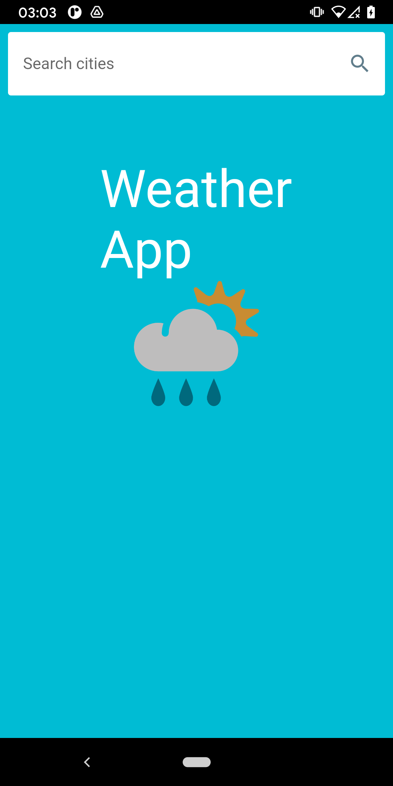
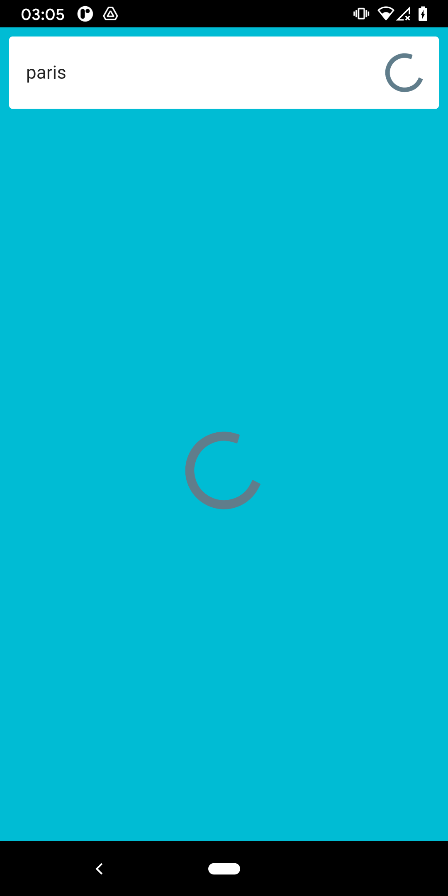
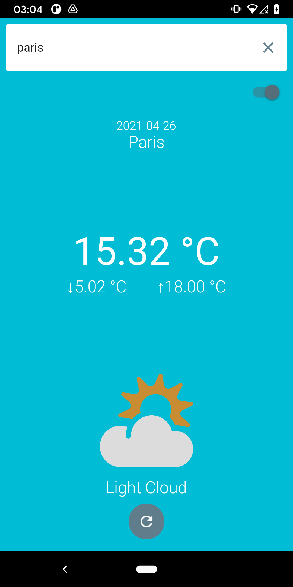
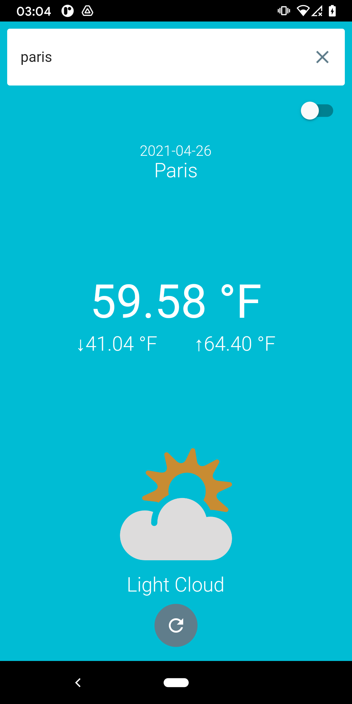

# flutter_bloc_simple_demo

Simple Flutter application created to demostrate:

- BLoC architecture.
- Unit testing.
- Widget testing.
- Dart sound null safety.
- Mockito 5.0.0 with code generation.

Download the apk [here.](https://drive.google.com/file/d/1rQnr9ifkLYNjNkVWYUsS5-CHoiS0boTT/view?usp=sharing)

 Initial State      | Loading State      | Loaded - Metric    | Loaded - Imperial
:------------------:|:------------------:|:------------------:|:------------------:
|||
